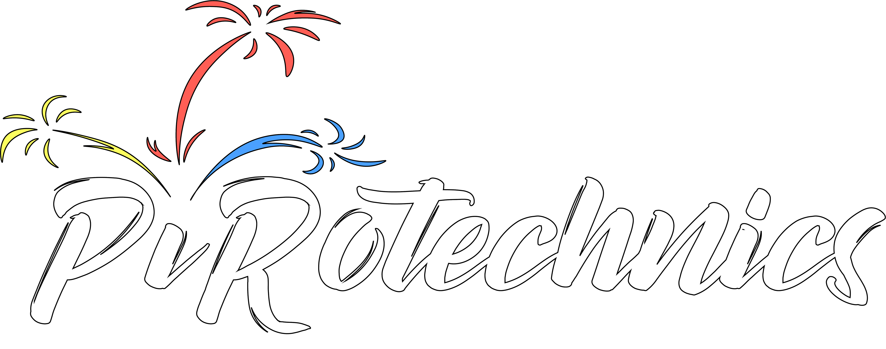

**LIVE DEMO AVAILABLE** (selfhosted, builded and deployed with Jenkins) **: [https://pirotechnics.sylvaindenyse.me](https://goo.gl/Wj3wDk 'PiRotechnics')**




# PiRotechnics

> A Vue.js project

## TODO

- [x] Show's list
- [x] Add show
- [x] Delete show
- [x] Add step
- [x] Delete step
- [x] Really mock GPIO
- [ ] Launch show
- [ ] Launch monitoring
- [ ] GPIO monitoring
- [ ] Make CSS great again...

## Build Setup

```bash
# install dependencies
yarn

# serve with hot reload at localhost:8080
yarn dev

# build for production with minification
yarn build

# build for production and view the bundle analyzer report
yarn build --report
```

For a detailed explanation on how things work, check out the [guide](http://vuejs-templates.github.io/webpack/) and [docs for vue-loader](http://vuejs.github.io/vue-loader).
